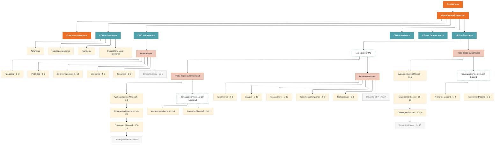

Полная иерархия ReVerie: от Основателя до стажёров. Ниже — визуальная схема подчинённости, а затем детализация по каждому направлению.

## Схема подчинённости

## Верхний уровень

<CardGroup cols={3}>
  <Card title="Основатель" icon="crown" horizontal>
    Владелец проекта. Определяет стратегию и ценности ReVerie.
  </Card>

  <Card title="Управляющий директор" icon="user-tie" horizontal>
    Оперативное руководство всей компанией.
  </Card>

  <Card title="Советник владельца" icon="lightbulb" horizontal>
    Консультативная роль при Основателе.
  </Card>
</CardGroup>

## C-level руководители

<CardGroup cols={2}>
  <Card title="COO — Директор по операциям" icon="gears">
    Арбитраж · Кураторы проектов · Партнёры · Основатели мини-проектов
  </Card>

  <Card title="CMO — Директор по развитию" icon="megaphone">
    Курирует медиа-направление и внешние коммуникации.
  </Card>

  <Card title="CFO — Директор по финансам" icon="wallet">
    Бюджеты, расчёты, финансовая отчётность.
  </Card>

  <Card title="CSO — Директор по безопасности" icon="shield">
    Информационная и организационная безопасность.
  </Card>

  <Card title="HRD — Директор по персоналу" icon="users" horizontal>
    Управляет всеми командами Minecraft, Discord и техсоставом.
  </Card>
</CardGroup>

## Направление COO — Операции

<AccordionGroup>
  <Accordion title="Прямое подчинение COO" defaultOpen icon="sitemap">
    - **Арбитраж** — независимый орган разрешения споров
    - **Кураторы проектов** — сопровождение мини-проектов
    - **Партнёры** — представители партнёрских проектов
    - **Основатели мини-проектов** — авторы одобренных инициатив
  </Accordion>
</AccordionGroup>

## Направление CMO — Медиа

<AccordionGroup>
  <Accordion title="Глава медиа" defaultOpen icon="clapperboard">
    | Роль | Численность |
    | --- | --- |
    | Продюсер | 1–2 |
    | Редактор | 2–3 |
    | Контент-креатор | 5–10 |
    | Оператор | 2–3 |
    | Дизайнер | 3–5 |
    | Стажёр медиа | до 5 |
  </Accordion>
</AccordionGroup>

## Направление HRD — Персонал

<Tabs>
  <Tab title="Менеджмент MC">
    <AccordionGroup>
      <Accordion title="Глава персонала Minecraft" defaultOpen icon="cube">
        **Линия модерации**

        - Администратор Minecraft · 3–5
          - Модератор Minecraft · 10–20
            - Помощник Minecraft · 15–25
              - Стажёр Minecraft · до 10

        **Команда внутренних дел Minecraft**

        - Инспектор Minecraft · 2–3
        - Аналитик Minecraft · 1–2
      </Accordion>

      <Accordion title="Глава техсостава" icon="wrench">
        | Роль | Численность |
        | --- | --- |
        | Архитектор | 2–3 |
        | Билдер | 5–10 |
        | Разработчик | 5–10 |
        | Технический аудитор | 2–3 |
        | Тестировщик | 3–5 |
        | Стажёр DEV | до 10 |
      </Accordion>
    </AccordionGroup>
  </Tab>
  <Tab title="Discord">
    <AccordionGroup>
      <Accordion title="Глава персонала Discord" defaultOpen icon="discord">
        **Линия модерации**

        - Администратор Discord · 3–5
          - Модератор Discord · 10–20
            - Помощник Discord · 20–30
              - Стажёр Discord · до 15

        **Команда внутренних дел Discord**

        - Аналитик Discord · 1–2
        - Инспектор Discord · 2–3
      </Accordion>
    </AccordionGroup>
  </Tab>
</Tabs>

<Note>
  Цифры в скобках — плановая численность каждой роли. Фактическая численность может отличаться в зависимости от этапа развития проекта.
</Note>